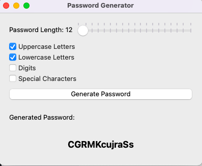

# Password Generator

This is a simple password generator application with a graphical user interface built using PyQt5 in Python.

## Features

- Choose the length of the password using a slider.
- Include uppercase and lowercase letters, digits, and special characters in the password.
- Display the generated password in a visually appealing way.
- Generate a password with a single click.

## Prerequisites

Make sure you have Python and PyQt5 installed on your system.

```bash
pip install PyQt5
```

## Installation

### macOS

To create a standalone executable for macOS using PyInstaller, run the following command:

```bash
pyinstaller --onefile --noconsole --osx-bundle-identifier=com.python.password.generator --icon=icon.png --name=PasswordGenerator pass.py
```

This command will generate a standalone executable file in the `dist` directory. You can then distribute this file without the need for Python or any dependencies.

## Usage

1. Run the application:

```bash
./dist/PasswordGenerator
```

2. Use the slider to choose the password length and select the desired options.
3. Click the "Generate Password" button to generate a password.

## Screenshots



## Contributing

Feel free to contribute to the project by submitting issues or pull requests.

## License

This project is licensed under the MIT License - see the [LICENSE](LICENSE) file for details.
```

Feel free to customize any other parts of the README as needed.